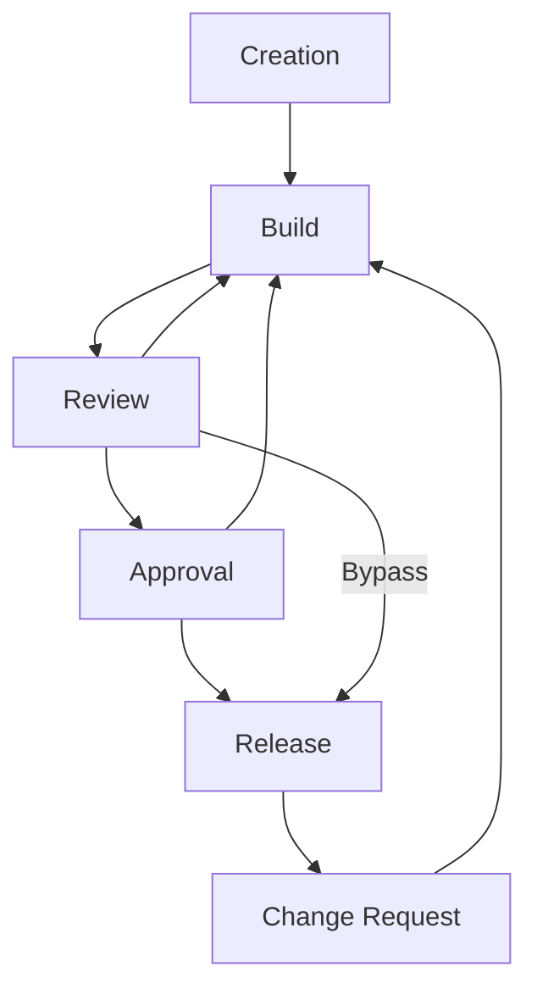

# Document Governance

This document outlines the procedures on how a document in _UWA Makers Group_ (hereforth *Makers*) are created and approved.

**Champion:** *Campbell Millar (22510848)*

**Classification:** *Red*

**Current Revision**: *Draft - 1*

|     Champion      | Date of Revison | Revison Number | Description                                                  |
| :---------------: | :-------------: | :------------: | ------------------------------------------------------------ |
| *Campbell Millar* |   18/12/2018    |  *Draft - 1*   | Initial creation of the document and build out of the document. Awaiting approval from the committee. |

## Definitions

1. Document;
   1. A document is a body of work that will effect any part of *Makers* either through operations or business activites
2. Champion;
   1. A champion of a document is a person or group that is designated to ensure the upkeep of a document
3. Classification;
   1. A classification is a set of rules that a document must follow for it to be valid within *Makers*
4. Member of *Makers*;
   1. Is a member defined underneat the constitution of the *Makers*
5. Senior Executive are the office bearing roles in *Makers* with the title of;
   1. President,
   2. Secretary, and
   3. Treasurer

## Creation & Governance of Documents

1. When a document is needed the senior executive should be contact to initiate the document creation
2. They will decide in the classification and the champion of the document in conjunction with the requesting user
3. After the classification and champion of the document is agreed apon by both parties the document is created in a secure place
4. The document will be created with accordance with it's classification
5. All members of the *Makers* are able to submit recommendations for changes on any document via the methods outlined by the classification
6. The document is then recorded by the Secretary with the following infomation;
   1. Name of document,
   2. Breif purpose of document,
   3. Classification of document,
   4. Champion of document,
   5. Who has editing access, and
   6. Any additional infomation specified by the classification
7. All documents must contain;
   1. Name of the document,
   2. Classification of the document,
   3. Champion of document, and
   4. A table showing revisions of the document including;
      1. The champion of the change, 
      2. Date of change, 
      3. Revision number, and
      4. Brief description of changes
8. After a document is published by the *Makers* any member of the *Makers* can request a change to the document at which;
   1. The champion of the document has to review the change request and determine if the document needs to be changed, or
   2. The classification has specified otherwise
9. If any changes to the document has been made it will require reappoval with accordance to the classification

## Classification of Documents

### Green

1. *Green Documents* are defined as;
   1. Techinical documents that do not need approval from any formal body in *Makers*
2. People that can edit *Green Documents* are;
   1. All Committee Memebers of the *Makers*,
   2. Champion of the document, and
   3. Any personnel that the Champion or Committee has elected
3. *Green Documents* do not need approval from an authority body
4. Examples of this documentation is;
   1. Advanced Documentation (Manuals)

### Yellow

1. *Yellow Documents* are defined as;
   1. A document that needs approval from one or more bodies in the *Makers* 
   2. Appoval body of the document needs to be recorded at the document creation
2. *Yellow Documents* must use version control (e.g. Google Documents, Track Changes, Git, SVN, or Mercurial)
3. *Yellow Documents* can only be approved through vote of a designated authority body determined at the creation of the document
4. No personnel of the club should have access to rewrite the history of *Yellow Documents*
5.  Senior Executives, champion and designated personnel have the ability to edit *Yellow Documents* whilst all members of *Makers* can submit recommendations
6. All published *Yellow Documents* must contain the *Makers* Seal of Approval
7. All requests to changes from any *Makers* members needs to be considered by the champion 
8. Examples of *Yellow Documents* are;
   1. Training documents

### Red

1. *Red Documents* are defined as;
   1. A document that needs review and publication of the current sitting committee
2. *Red Documents* must use strict version control (e.g. Git, SVN, or Mercurial)
3. *Red Documents* can only be approved through vote of a majority committee
   1. The people whom have voted in the document release need to be recored by the Secretary 
4. No personnel of the club should have access to rewrite the history of *Red Documents* 
5. Senior Executives have the ability to edit *Red Documents* whilst all members of *Makers* can submit recommendations
6. All published *Red Documents* must contain the *Makers* Seal of Approval
7. All requests to changes from any *Makers* members needs to be considered by the committee
8. Examples of *Red Documents* are;
   1. Bylaws, and
   2. Meetings Minutes (finalised)

### Purple

1. *Purple Documents* are defined as;
   1. A document that needs review and publication of the community by way of a General Meeting
2. *Purple Documents* must use strict version control 
3. *Purple Documents* can only be approved through vote of a majority of voting Members at a General Meeting defined underneath the *Makers* constitution 
   1. The people whom have voted in the document release need to be recored by the Secretary 
4. No personnel of the club should have access to rewrite the history of *Purple Documents* 
5. No personnel have access to directly edit purple documents
6. All published *Purple Documents* must contain the *Makers* Seal of Approval
7. All requests to changes from any *Makers* members needs to be considered by the committee
8. Examples of *Purple Documents* are;
   1. Constitution

## Publication of Document

1. Published documents should be converted to a PDF 
2. All published documents should be easily accessible by any member of the *Makers*
3. All published PDFs need to be read-only

## Use of a Wiki

1. All documentation completed on a wiki is considered as a *Green* classification

2. Use of a Wiki should be for a way to redirect users to the relevent published documents
## Flow for Documentation

Below is a diagram showing the flow for a document and descriptions of each step. The descriptions are not binding (where as the above policy is) and is only for ease of understanding. 

### Creation

To create a document that the *Makers* sees as a valid document the President, Secretary, or Treasurer (Senior Executive). The actionee and the Senior Executive will discuss what classifcation, who is the champion of the document (a person who is responsible for the upkeep of the document), and if the classification requires it the people required to approve the document. 

Once a decision is agreeded apon then the document is created by Senior Executive in a secure place and the agreed personnel are given access to edit the document. All members of the *Makers* have the right to add suggestions to the document. 

### Build

In this stage the main build out of the document is commenced with the champion/authorised personnel creating the bulk of the document and other members suggesting additional changes. This is the largest step of the document creation process.

### Review

The document is then reviewed by the champion and create a breif description of the changes to the document. This is also the stage where most of the suggested changes are considered and added in.

### Approval

The document is then published to the relevant authority body for approval. They will decide if the document is correct and they place the *Makers* Seal of Approval to officiate the document. The approval body may also request the document to be pushed into the build stage if required.

#### Bypass

The bypass is only for *Green* documents as they do not require approval from a governing body.

### Release

After the approval body has approved the document the document is then converted to a PDF and published in a read-only publicly accessable place.

### Change Request

If a member of *Makers* has requested then the champion of the document will need to review the change request and determine if the change is nessosary. If the champion needs to change the document then the document goes back into the *Build* stage.